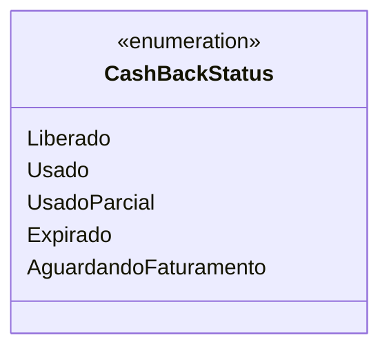

# CashBackStatus
**Namespace**: IsthmusWinthor.Dominio.Enumeradores  
**Nome do Arquivo**: CashBackStatus.cs  

O `CashBackStatus` é um enumerador que define os diferentes estados que um Cashback pode ter ao longo de seu ciclo de vida. Ele fornece uma maneira padronizada de representar e manusear esses estados em toda a aplicação, contribuindo para a clareza e manutenção do código.

## Tipos Auxiliares e Dependências
- Nenhuma dependência de classes complexas ou outros enums.

---
Gerada em 29/12/2025 20:53:25
