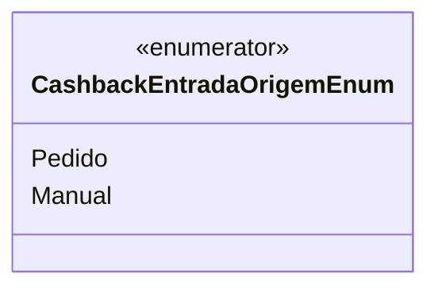

# CashbackEntradaOrigemEnum
**Namespace**: IsthmusWinthor.Dominio.Enumeradores  
**Nome do Arquivo**: CashbackEntradaOrigemEnum.cs  

O `CashbackEntradaOrigemEnum` é um enumerador utilizado para representar as origens válidas de entrada de cashback em um sistema financeiro. Este enum é essencial para a lógica de negócios que determina de onde provêm as entradas de cashback, permitindo que o sistema identifique corretamente a origem de cada entrada.

## Tipos Auxiliares e Dependências
- **Enumeradores**:
  - `CashbackEntradaOrigemEnum`  

## Diagrama de Relacionamentos

---
Gerada em 29/12/2025 20:53:11
