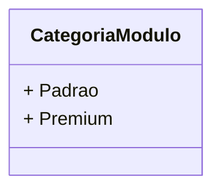

# CategoriaModulo
**Namespace**: IsthmusWinthor.Dominio.Enumeradores  
**Nome do Arquivo**: CategoriaModulo.cs  

Este é um enumerador que auxilia na categorização de módulos dentro de um sistema, classificando-os em tipos distintos, o que é essencial para a organização e gestão das funcionalidades oferecidas.

## Tipos Auxiliares e Dependências
- **Enums:**
  - `[CategoriaModulo](CategoriaModulo.md)`

## Diagrama de Relacionamentos

---

Nesse contexto, como a classe se trata de um `enum`, a documentação se concentrou na sua função de categorizar as opções de módulos disponíveis, essencial para a estrutura organizacional do sistema.
