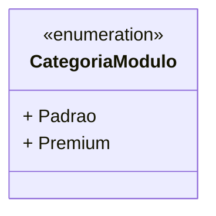

# CategoriaModulo
**Namespace**: IsthmusWinthor.Dominio.Enumeradores  
**Nome do Arquivo**: CategoriaModulo.cs  

O `CategoriaModulo` é um enumerador que define as categorias dos módulos disponíveis no sistema, permitindo a classificação entre funcionalidades padrão e premium.

### Tipos Auxiliares e Dependências
- Enumeradores:
  - [CategoriaModulo](CategoriaModulo.md)

### Diagrama de Relacionamentos

---
Gerada em 29/12/2025 20:53:28
