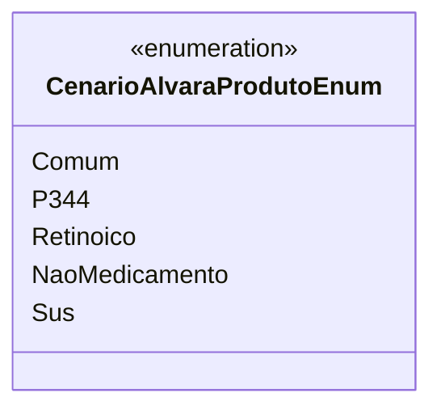

# CenarioAlvaraProdutoEnum
**Namespace**: IsthmusWinthor.Dominio.Enumeradores  
**Nome do Arquivo**: CenarioAlvaraProdutoEnum.cs  

O `CenarioAlvaraProdutoEnum` é um enumerador cuja finalidade é categorizar os diferentes cenários relacionados à liberação de produtos no âmbito de alvarás. Esse tipo de classificação é fundamental para garantir que os procedimentos relacionados à autorização e regulamentação de produtos sejam seguidos corretamente.

### Tipos Auxiliares e Dependências
- **Enumeradores**:
  - `CenarioAlvaraProdutoEnum` (este mesmo).

### Diagrama de Relacionamentos

---
Gerada em 29/12/2025 20:53:32
