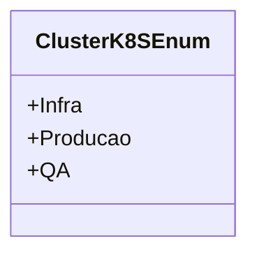

# ClusterK8SEnum

**Namespace**: IsthmusWinthor.Dominio.Enumeradores  
**Nome do Arquivo**: ClusterK8SEnum.cs  

O `ClusterK8SEnum` é um enumerador utilizado para categorizar os diferentes ambientes de cluster Kubernetes, facilitando a identificação e seleção de ambientes específicos dentro de um sistema de gerenciamento. 

## Tipos Auxiliares e Dependências
- **Enumeradores**:
  - `[ClusterK8SEnum](ClusterK8SEnum.md)` 

## Diagrama de Relacionamentos

---
Gerada em 29/12/2025 20:53:35
