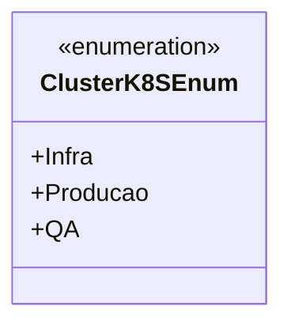

# ClusterK8SEnum
**Namespace**: IsthmusWinthor.Dominio.Enumeradores  
**Nome do Arquivo**: ClusterK8SEnum.cs

Esta classe enumera os diferentes clusters de Kubernetes utilizados no sistema, facilitando a categorização e управления política de deployments.

### Tipos Auxiliares e Dependências
- **Enumeradores**:
  - `[ClusterK8SEnum](ClusterK8SEnum.md)`

### Diagrama de Relacionamentos

