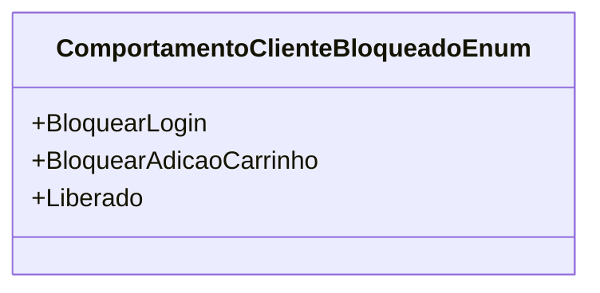

# ComportamentoClienteBloqueadoEnum
**Namespace**: IsthmusWinthor.Dominio.Enumeradores  
**Nome do Arquivo**: ComportamentoClienteBloqueadoEnum.cs

Esta classe é um Enum que representa os diferentes comportamentos que um cliente pode ter em relação ao bloqueio de sua conta no sistema.

## Tipos Auxiliares e Dependências
- **Enumeradores:**
  - `ComportamentoClienteBloqueadoEnum`: Define os estados de bloqueio do cliente.

## Diagrama de Relacionamentos

