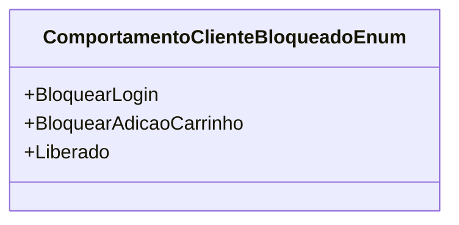

# ComportamentoClienteBloqueadoEnum
**Namespace**: IsthmusWinthor.Dominio.Enumeradores  
**Nome do Arquivo**: ComportamentoClienteBloqueadoEnum.cs

Este enumerador define os diferentes comportamentos que podem ser atribuídos a um cliente bloqueado no sistema. Ele é utilizado para controlar o acesso e as ações que um cliente pode realizar na plataforma, garantindo que as regras de negócios relacionadas ao bloqueio de clientes sejam implementadas de forma consistente.

## Tipos Auxiliares e Dependências
- **Classe Enum:** `ComportamentoClienteBloqueadoEnum`

## Diagrama de Relacionamentos

---
Gerada em 29/12/2025 20:53:39
