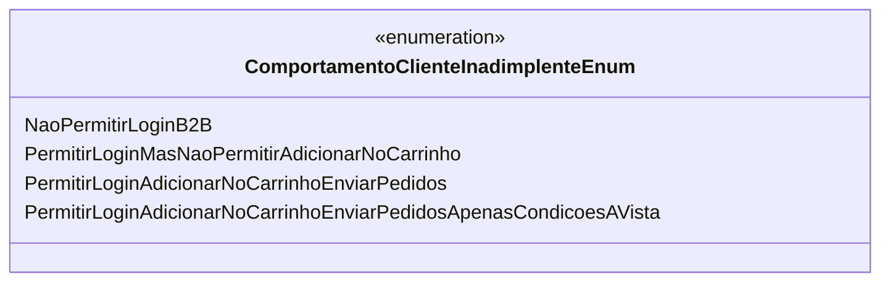

# ComportamentoClienteInadimplenteEnum
- **Namespace**: IsthmusWinthor.Dominio.Enumeradores
- **Nome do Arquivo**: ComportamentoClienteInadimplenteEnum.cs

O `ComportamentoClienteInadimplenteEnum` é um enumerador que define as diferentes permissões de acesso e ações que um cliente inadimplente pode realizar dentro do sistema.

## Tipos Auxiliares e Dependências
- **Enums**:
  - `[ComportamentoClienteInadimplenteEnum](ComportamentoClienteInadimplenteEnum.md)`: Define os comportamentos permitidos para clientes que estão inadimplentes no sistema.

## Diagrama de Relacionamentos

