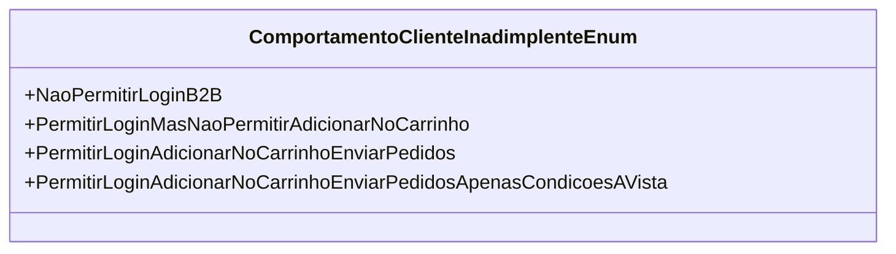

# ComportamentoClienteInadimplenteEnum
**Namespace**: IsthmusWinthor.Dominio.Enumeradores  
**Nome do Arquivo**: ComportamentoClienteInadimplenteEnum.cs  

O `ComportamentoClienteInadimplenteEnum` é um enumerador que define os diferentes comportamentos que um cliente inadimplente pode ter em relação ao acesso e utilização de serviços e funcionalidades da plataforma, como login e operações de compra.

## Tipos Auxiliares e Dependências
- Enum: [ComportamentoClienteInadimplenteEnum](ComportamentoClienteInadimplenteEnum.md)

## Diagrama de Relacionamentos

---
Gerada em 29/12/2025 20:53:43
