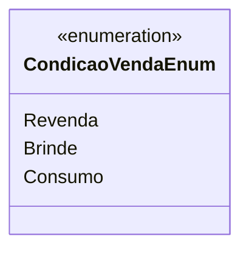

# CondicaoVendaEnum
**Namespace**: IsthmusWinthor.Dominio.Enumeradores  
**Nome do Arquivo**: CondicaoVendaEnum.cs  

O `CondicaoVendaEnum` é um enumerador que define as diferentes condições de venda aplicáveis ao sistema, possibilitando a categorização das transações de forma clara e padronizada.

## Tipos Auxiliares e Dependências
- `CondicaoVendaEnum`: Enumeração que representa as diferentes condições de venda.

## Diagrama de Relacionamentos

---
Gerada em 29/12/2025 20:53:46
