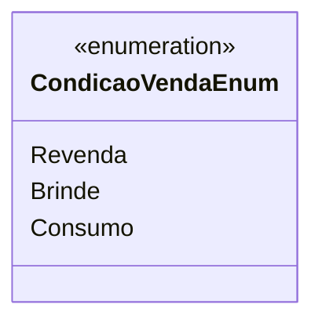

# CondicaoVendaEnum
**Namespace**: IsthmusWinthor.Dominio.Enumeradores  
**Nome do Arquivo**: CondicaoVendaEnum.cs  

### Citação
Enumeração destinada a categorizar as condições de venda no sistema, servindo como um tipo auxiliar para identificar o tipo de transação comercial realizada. 

### Tipos Auxiliares e Dependências
- `CondicaoVendaEnum`: Enum que define as diferentes condições de venda:
  - **Revenda**: Representa uma venda para retorno ao mercado de revenda.
  - **Brinde**: Identifica produtos que são oferecidos como brindes.
  - **Consumo**: Refere-se a produtos que serão consumidos pelo comprador final. 

### Diagrama de Relacionamentos

