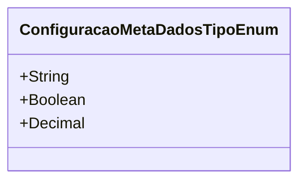

# ConfiguracaoMetaDadosTipoEnum
**Namespace**: IsthmusWinthor.Dominio.Enumeradores  
**Nome do Arquivo**: ConfiguracaoMetaDadosTipoEnum.cs  

Este é um *enumerador* que define os tipos de configurações de meta dados que podem ser utilizados dentro da aplicação. Ele transporta valores que representam diferentes tipos de dados, garantido que o sistema reconheça e utilize as configurações de forma consistente.

## Tipos Auxiliares e Dependências
- **Enums**:
  - `[ConfiguracaoMetaDadosTipoEnum](ConfiguracaoMetaDadosTipoEnum.md)`

## Diagrama de Relacionamentos

