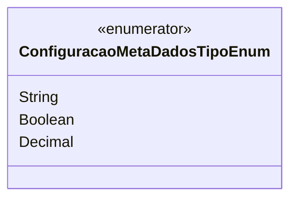

# ConfiguracaoMetaDadosTipoEnum
**Namespace**: IsthmusWinthor.Dominio.Enumeradores  
**Nome do Arquivo**: ConfiguracaoMetaDadosTipoEnum.cs  

O `ConfiguracaoMetaDadosTipoEnum` é um enumerador que define os tipos de dados que podem ser utilizados na configuração de metadados. Ele serve para garantir a integridade dos dados ao especificar quais tipos são aceitos, facilitando a manipulação e validação no sistema.

## Tipos Auxiliares e Dependências
- **Enumeradores**:
  - `ConfiguracaoMetaDadosTipoEnum`: Define os tipos de dados disponíveis. As opções incluem:
    - `String`: Representa um valor textual.
    - `Boolean`: Representa um valor verdadeiro ou falso.
    - `Decimal`: Representa um valor numérico decimal.

## Diagrama de Relacionamentos

---
Gerada em 29/12/2025 20:53:51
