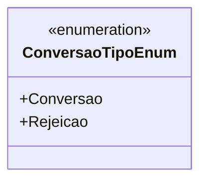

# ConversaoTipoEnum
**Namespace**: IsthmusWinthor.Dominio.Enumeradores  
**Nome do Arquivo**: ConversaoTipoEnum.cs  

Este enumerador é utilizado para categorizar o tipo de conversão em um sistema, ajudando a controlar e distinguir entre diferentes estados possíveis no fluxo de uma aplicação.

## Tipos Auxiliares e Dependências
- **Enums**:  
  - [ConversaoTipoEnum](ConversaoTipoEnum.md) 

## Diagrama de Relacionamentos

---
Gerada em 29/12/2025 20:53:54
