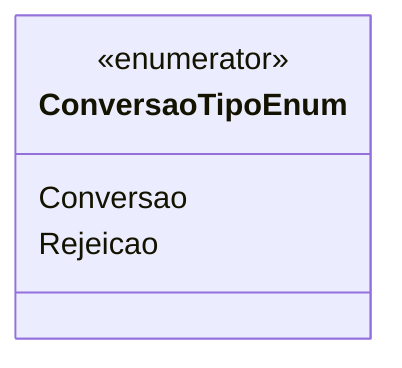

# ConversaoTipoEnum
- **Namespace**: IsthmusWinthor.Dominio.Enumeradores
- **Nome do Arquivo**: ConversaoTipoEnum.cs

Este enumerador é utilizado para identificar os tipos de conversão que podem ocorrer em um fluxo de negócio, categorizando as operações como "Conversão" ou "Rejeição". 

## Tipos Auxiliares e Dependências
- **Enumeradores**: 
  - `[ConversaoTipoEnum](ConversaoTipoEnum.md)` 

## Diagrama de Relacionamentos

