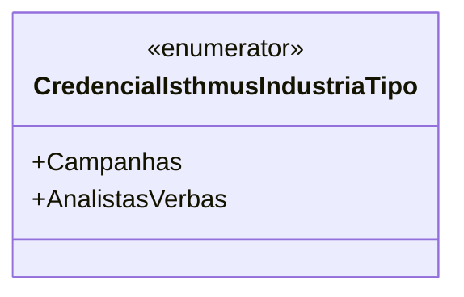

# CredencialIsthmusIndustriaTipo
**Namespace**: IsthmusWinthor.Dominio.Enumeradores  
**Nome do Arquivo**: CredencialIsthmusIndustriaTipo.cs  

## Visão Geral e Responsabilidade
O `CredencialIsthmusIndustriaTipo` é um enumerador que define os tipos de credenciais associadas ao sistema de gerenciamento de campanhas e a profissionais responsáveis pela alocação de verba. Este enum proporciona uma forma estruturada de categorizar os diferentes tipos de credenciais necessárias para a operação de diferentes funções no sistema. A sua implementação ajuda a garantir que os valores utilizados no código sejam consistentes e compreensíveis.

## Tipos Auxiliares e Dependências
- **Enumeradores**:
  - `[CredencialIsthmusIndustriaTipo](CredencialIsthmusIndustriaTipo.md)`

## Diagrama de Relacionamentos

