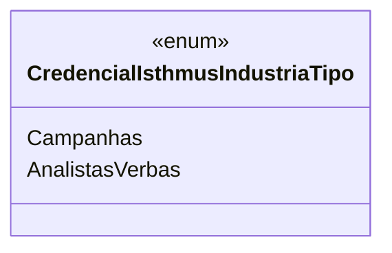

# CredencialIsthmusIndustriaTipo
**Namespace**: IsthmusWinthor.Dominio.Enumeradores  
**Nome do Arquivo**: CredencialIsthmusIndustriaTipo.cs

Este é um enumerador que define os tipos de credenciais disponíveis para uso no sistema. Ele transporta informações de tipo de credencial e facilita a validação e o gerenciamento de permissões de acesso associadas a diferentes funcionalidades relacionadas à indústria da plataforma Isthmus Winthor.

## Tipos Auxiliares e Dependências
- **Enumeradores**:
  - [CredencialIsthmusIndustriaTipo](CredencialIsthmusIndustriaTipo.md)

## Diagrama de Relacionamentos

---
Gerada em 29/12/2025 20:53:58
