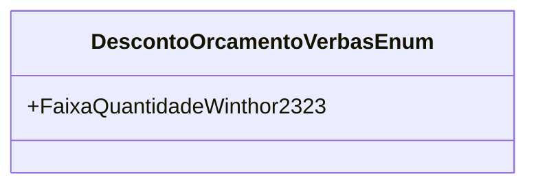

# DescontoOrcamentoVerbasEnum

**Namespace**: IsthmusWinthor.Dominio.Enumeradores  
**Nome do Arquivo**: DescontoOrcamentoVerbasEnum.cs  

O `DescontoOrcamentoVerbasEnum` é um enumerador que representa as faixas de descontos aplicáveis às verbas orçamentárias dentro do sistema. Este tipo auxiliar é essencial para garantir a padronização nas operações relacionadas a descontos, assegurando que as regras de negócio sejam aplicadas corretamente em diferentes partes da aplicação.

## Tipos Auxiliares e Dependências

- **Enumeradores:**
  - `[DescontoOrcamentoVerbasEnum](DescontoOrcamentoVerbasEnum.md)`

## Diagrama de Relacionamentos

Este diagrama ilustra que o `DescontoOrcamentoVerbasEnum` consiste em um único membro, `FaixaQuantidadeWinthor2323`, que representa uma das opções de desconto disponíveis no sistema.
