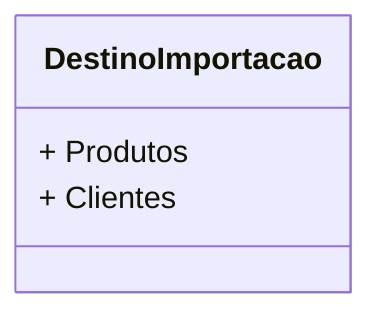

# DestinoImportacao
**Namespace**: IsthmusWinthor.Dominio.Enumeradores  
**Nome do Arquivo**: DestinoImportacao.cs  

O `DestinoImportacao` é um enumerador que define as categorias de destino para operações de importação dentro do sistema, permitindo a organização e o direcionamento correto dos dados importados.

## Tipos Auxiliares e Dependências
- `DestinoImportacao`: Enum que categoriza os destinos disponíveis para importação de dados.

## Diagrama de Relacionamentos

Essa estrutura documenta o enumerador de forma clara e concisa, destacando sua função no contexto geral do sistema.
