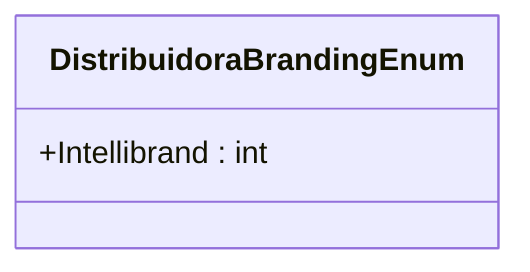

# DistribuidoraBrandingEnum
**Namespace**: IsthmusWinthor.Dominio.Enumeradores  
**Nome do Arquivo**: DistribuidoraBrandingEnum.cs  

Distribui as marcas disponíveis para os distribuidores, permitindo que o sistema identifique e utilize as branding corretas para cada integração.

## Tipos Auxiliares e Dependências
- Enumeradores:
  - [DistribuidoraBrandingEnum](DistribuidoraBrandingEnum.md)
  
## Diagrama de Relacionamentos

---
Gerada em 29/12/2025 20:54:07
