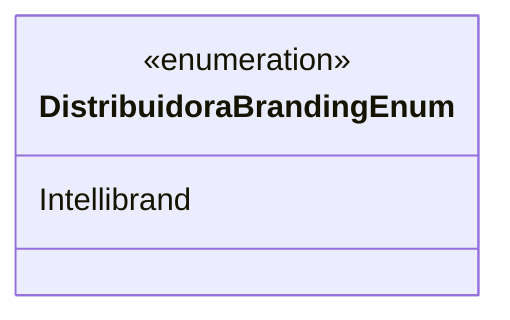

# DistribuidoraBrandingEnum
**Namespace**: IsthmusWinthor.Dominio.Enumeradores  
**Nome do Arquivo**: DistribuidoraBrandingEnum.cs  

Esta enumeração representa as marcas de distribuidor disponíveis no sistema, facilitando a identificação e categorização de brandings associados a produtos ou serviços.

## Tipos Auxiliares e Dependências
- `DistribuidoraBrandingEnum`: Enum que lista as marcas de distribuidor disponíveis.

## Diagrama de Relacionamentos

