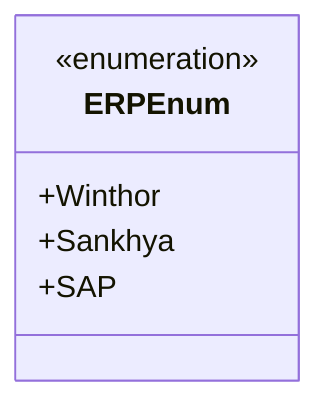

# ERPEnum
- **Namespace**: IsthmusWinthor.Dominio.Enumeradores
- **Nome do Arquivo**: ERPEnum.cs

O `ERPEnum` é um enumerador que define os diferentes sistemas de ERP (Enterprise Resource Planning) disponíveis no contexto do sistema, permitindo a padronização e fácil referência a esses tipos ao longo da aplicação. 

### Tipos Auxiliares e Dependências
- **Enumeradores**:
  - `ERPEnum`: Define os sistemas de ERP suportados: Winthor, Sankhya, e SAP.

### Diagrama de Relacionamentos

