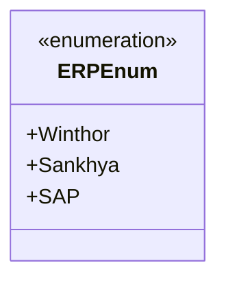

# ERPEnum
**Namespace**: IsthmusWinthor.Dominio.Enumeradores  
**Nome do Arquivo**: ERPEnum.cs  

O `ERPEnum` é uma enumeração que representa os sistemas de planejamento de recursos empresariais (ERP) suportados pela aplicação. Seu propósito é fornecer uma forma tipada e segura para referenciar as diferentes opções de ERP disponíveis, minimizando erros de string e melhorando a legibilidade do código.

## Tipos Auxiliares e Dependências
- **Enumeradores**:
  - [ERPEnum](ERPEnum.md): Enumeração que define os tipos de sistemas ERP. 

## Diagrama de Relacionamentos

---
Gerada em 29/12/2025 20:54:18
