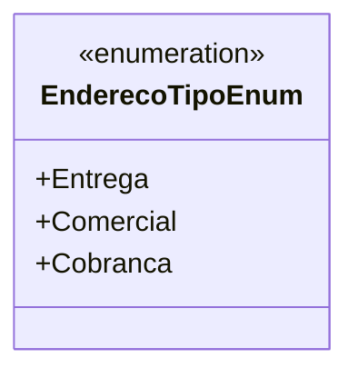

# EnderecoTipoEnum
**Namespace**: IsthmusWinthor.Dominio.Enumeradores  
**Nome do Arquivo**: EnderecoTipoEnum.cs  

`EnderecoTipoEnum` é uma enumeração utilizada para categorizar diferentes tipos de endereços que podem ser associados a uma entidade no sistema.

### Tipos Auxiliares e Dependências
- Não há classes complexas do domínio ou propriedades associadas. 
- Esta enumeração pode ser utilizada em várias partes do sistema para garantir que os endereços sejam classificados corretamente, o que ajuda a manter a integridade dos dados em processos de entrega, cobrança e operações comerciais.

### Diagrama de Relacionamentos

---
Gerada em 29/12/2025 20:54:11
