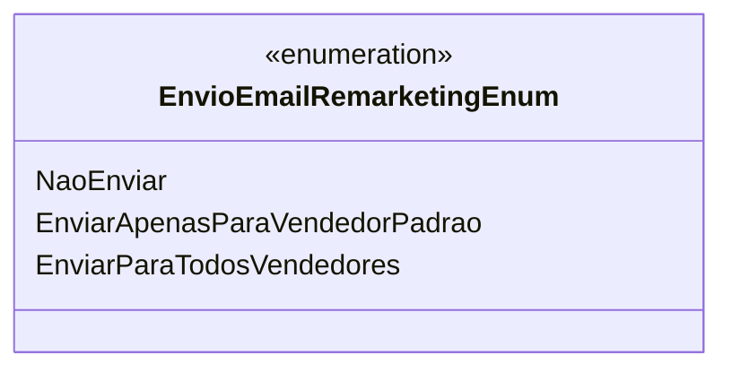

# EnvioEmailRemarketingEnum
**Namespace**: IsthmusWinthor.Dominio.Enumeradores  
**Nome do Arquivo**: EnvioEmailRemarketingEnum.cs  

Esta classe enumera as opções para o envio de emails de remarketing, definindo as ações a serem tomadas em relação aos vendedores.

## Tipos Auxiliares e Dependências
- Nenhum tipo auxiliar ou classe estática/helper está diretamente associado a esta enumeração.

## Diagrama de Relacionamentos

---
Gerada em 29/12/2025 20:54:15
