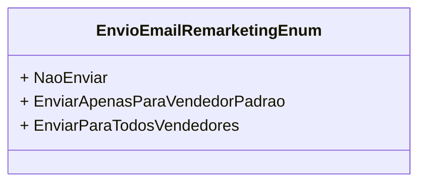

# EnvioEmailRemarketingEnum
**Namespace**: IsthmusWinthor.Dominio.Enumeradores  
**Nome do Arquivo**: EnvioEmailRemarketingEnum.cs

Este enumerador é responsável por definir as opções de envio de e-mails de remarketing para diferentes grupos de usuários dentro do sistema.

## Tipos Auxiliares e Dependências
- Nenhuma classe complexa do domínio.
- Enumerações:
  - `[EnvioEmailRemarketingEnum](EnvioEmailRemarketingEnum.md)`

## Diagrama de Relacionamentos

