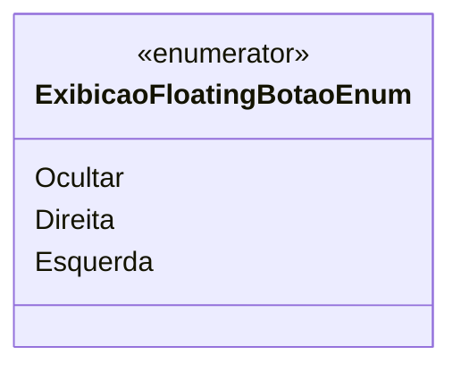

# ExibicaoFloatingBotaoEnum
**Namespace**: IsthmusWinthor.Dominio.Enumeradores  
**Nome do Arquivo**: ExibicaoFloatingBotaoEnum.cs  

O `ExibicaoFloatingBotaoEnum` é um enumerador que define as opções de exibição de um botão flutuante em uma interface de usuário, facilitando a personalização da posição e da visibilidade desse elemento.

## Tipos Auxiliares e Dependências
- `Enum`: Tipo auxiliar utilizado para definir as opções de exibição.
  
## Valores do Enum
- `Ocultar (1)`: Indica que o botão flutuante deve ser ocultado na interface.
- `Direita (2)`: Confere ao botão flutuante a posição à direita da tela.
- `Esquerda (3)`: Define que o botão flutuante ficará posicionado à esquerda da tela.

### Diagrama de Relacionamentos

---
Gerada em 29/12/2025 20:54:24
