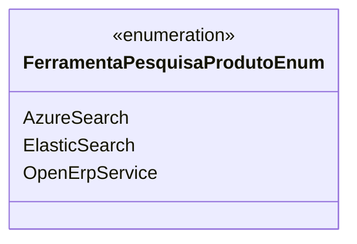

# FerramentaPesquisaProdutoEnum
**Namespace**: IsthmusWinthor.Dominio.Enumeradores  
**Nome do Arquivo**: FerramentaPesquisaProdutoEnum.cs  

O `FerramentaPesquisaProdutoEnum` é um enumerador que representa as diferentes ferramentas de pesquisa disponíveis para a busca de produtos no sistema. Este enum facilita a utilização de constantes que correspondem a opções de pesquisa, garantindo que o sistema se mantenha consistente e que as comparações ou seleções feitas com esses valores sejam mais legíveis e seguras.  

## Tipos Auxiliares e Dependências
- Nenhum.

## Diagrama de Relacionamentos

