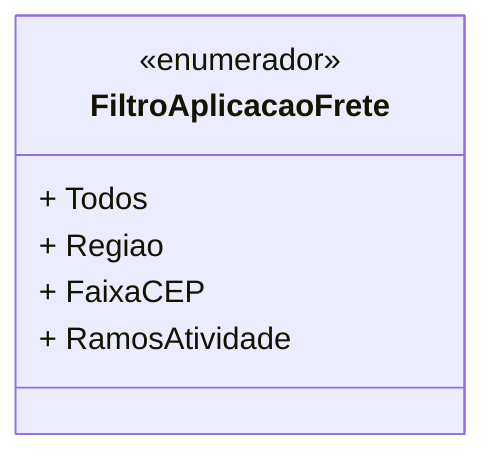

# FiltroAplicacaoFrete
- **Namespace**: IsthmusWinthor.Dominio.Enumeradores
- **Nome do Arquivo**: FiltroAplicacaoFrete.cs

Este enum é utilizado para representar os diferentes filtros que podem ser aplicados no cálculo de frete, facilitando a personalização das regras de negócio associadas ao transporte e entrega de produtos.

## Tipos Auxiliares e Dependências
- **Enumeradores**:
  - `[FiltroAplicacaoFrete](FiltroAplicacaoFrete.md)`

## Diagrama de Relacionamentos

