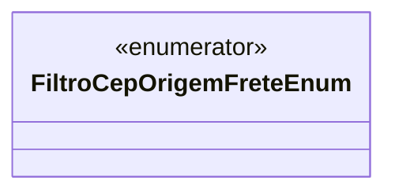

# FiltroCepOrigemFreteEnum

**Namespace**: IsthmusWinthor.Dominio.Enumeradores  
**Nome do Arquivo**: FiltroCepOrigemFreteEnum.cs  

Este enumerador é utilizado para definir as diferentes origens de filtro de CEP para cálculos ou verificações relacionadas a frete dentro do sistema. 

### Tipos Auxiliares e Dependências
- Nenhum.

### Diagrama de Relacionamentos

---
Gerada em 29/12/2025 20:54:33
