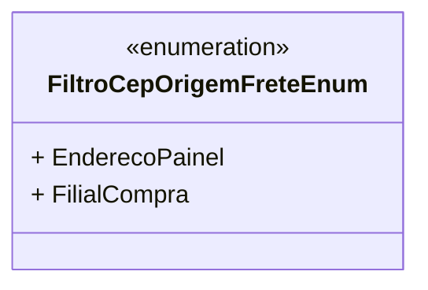

# FiltroCepOrigemFreteEnum

**Namespace**: IsthmusWinthor.Dominio.Enumeradores  
**Nome do Arquivo**: FiltroCepOrigemFreteEnum.cs

Este enumerador é utilizado para definir os tipos de filtros disponíveis para a origem do CEP no cálculo de frete, facilitando a seleção e validação correta nos processos que envolvem informações de endereçamento. 

## Tipos Auxiliares e Dependências

- **Enums**:
  - `[FiltroCepOrigemFreteEnum](FiltroCepOrigemFreteEnum.md)`

## Diagrama de Relacionamentos

