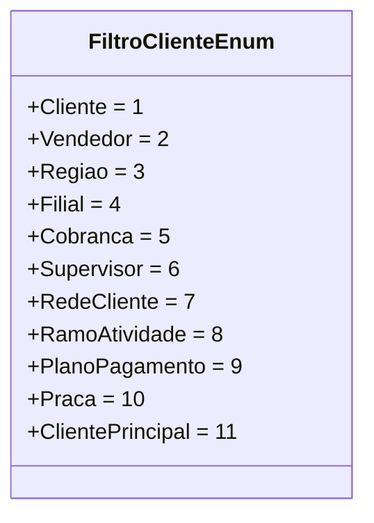

# FiltroClienteEnum
**Namespace**: IsthmusWinthor.Dominio.Enumeradores  
**Nome do Arquivo**: FiltroClienteEnum.cs  

## Visão Geral e Responsabilidade
O `FiltroClienteEnum` é uma enumeração que fornece valores predefinidos para diferentes filtros que podem ser aplicados na seleção ou agrupamento de clientes em um sistema. A enumeração encapsula todas as categorias relevantes que podem ser utilizadas pelos desenvolvedores e usuários, garantindo um uso consistente e compreensível desses filtros ao longo da aplicação.

## Métodos de Negócio
N/A

## Propriedades Calculadas e de Validação
N/A

## Navigations Property
N/A

## Tipos Auxiliares e Dependências
Nenhum.

## Diagrama de Relacionamentos

