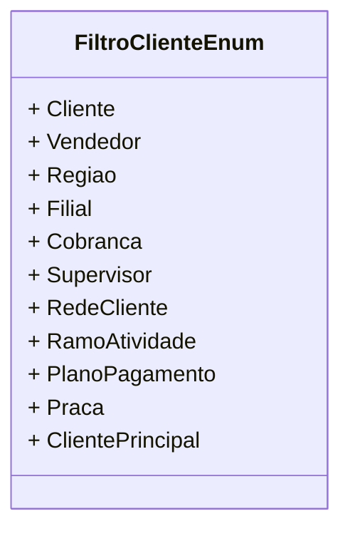

# FiltroClienteEnum
**Namespace**: IsthmusWinthor.Dominio.Enumeradores  
**Nome do Arquivo**: FiltroClienteEnum.cs

## Visão Geral e Responsabilidade
O `FiltroClienteEnum` é um enumerador que define diferentes critérios de filtragem aplicáveis a clientes dentro do sistema de gerenciamento. Ele é útil para categorizar e organizar dados de clientes, facilitando a busca e a visualização das informações relevantes em relatórios e dashboards.

## Valores do Enum
Cada membro do `FiltroClienteEnum` representa um tipo distinto de filtro que pode ser aplicado aos dados de clientes. Abaixo estão os tipos de filtro disponíveis:

- `Cliente`: Identifica informações específicas de um cliente.
- `Vendedor`: Filtros relacionados ao vendedor responsável pelo cliente.
- `Regiao`: Filtra os clientes por região geográfica.
- `Filial`: Utilizado para identificar clientes em diferentes filiais da empresa.
- `Cobranca`: Relativo a informações e status de cobrança de clientes.
- `Supervisor`: Filtra a lista de clientes com base em seus supervisores diretos.
- `RedeCliente`: Usado para filtrar clientes que fazem parte de uma rede maior.
- `RamoAtividade`: Filtra clientes com base em seu ramo de atividade, permitindo uma análise mais segmentada.
- `PlanoPagamento`: Filtros que ajudam a identificar clientes com diferentes planos de pagamento.
- `Praca`: Relaciona clientes a praças específicas onde eles operam.
- `ClientePrincipal`: Identifica se o cliente é um cliente principal dentro de um grupo ou rede.

## Tipos Auxiliares e Dependências
- Este enumerador não possui dependências diretas, mas pode ser utilizado em combinação com classes e lógica do domínio que gerenciam entidades de cliente e suas interações.

## Diagrama de Relacionamentos

Essa estrutura de documentação proporciona uma visão clara e concisa sobre as regras de negócio e a utilidade do enumerador `FiltroClienteEnum`, abordando tanto a integridade de dados quanto a categorização necessária para auxiliar em processos de busca e filtração no sistema.
---
Gerada em 29/12/2025 20:54:43
