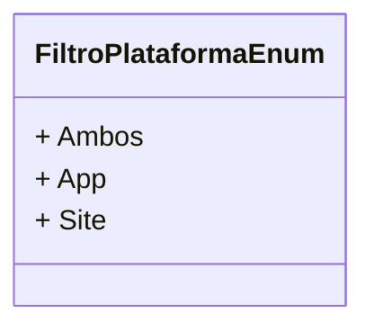

# FiltroPlataformaEnum
- **Namespace**: IsthmusWinthor.Dominio.Enumeradores
- **Nome do Arquivo**: FiltroPlataformaEnum.cs

Esta classe enum é responsável por definir os diferentes filtros de plataforma disponíveis no sistema, facilitando a seleção de opções para o usuário.

## Tipos Auxiliares e Dependências
- Não há outros tipos auxiliares ou dependências listados além desta enumeração.

## Diagrama de Relacionamentos

---
Gerada em 29/12/2025 20:54:46
