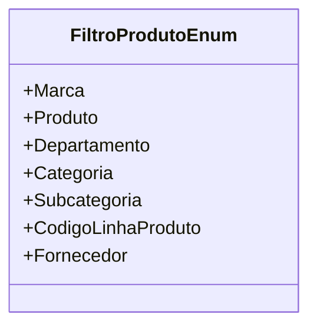

# FiltroProdutoEnum

**Namespace**: IsthmusWinthor.Dominio.Enumeradores  
**Nome do Arquivo**: FiltroProdutoEnum.cs  

O `FiltroProdutoEnum` é um enumerador que define diferentes filtros aplicáveis à busca e categorização de produtos dentro do sistema. Essa estrutura é fundamental para a implementação de filtros dinâmicos nas buscas de produtos, permitindo que os usuários escolham critérios específicos para refinar suas pesquisas.

## Tipos Auxiliares e Dependências

- `Display`: Atributo utilizado para fornecer descrições amigáveis para os valores do enumerador.

### Enumeradores
- [FiltroProdutoEnum](FiltroProdutoEnum.md): Enumeração que contém diferentes opções de filtros para produtos.

## Diagrama de Relacionamentos

---
Gerada em 29/12/2025 20:54:51
