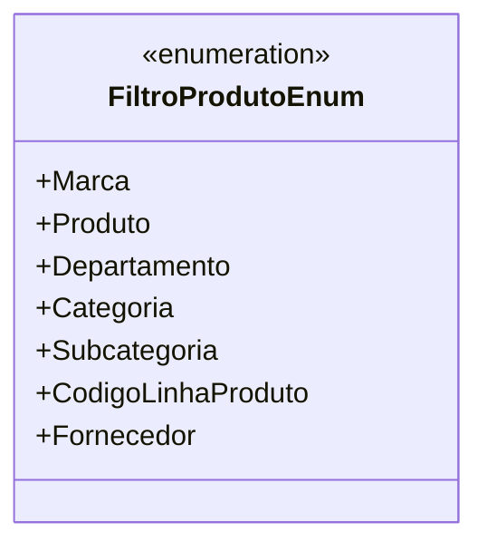

# FiltroProdutoEnum
- **Namespace**: IsthmusWinthor.Dominio.Enumeradores
- **Nome do Arquivo**: FiltroProdutoEnum.cs

O `FiltroProdutoEnum` é um enumerador que define os diferentes critérios pelos quais os produtos podem ser filtrados na aplicação. Cada constante representa uma forma específica de categorização que auxilia na busca e na organização dos produtos, garantindo que os usuários possam localizar itens de forma eficiente.

## Tipos Auxiliares e Dependências
- Nenhum tipo auxiliar específico ou dependência externa.

## Diagrama de Relacionamentos

