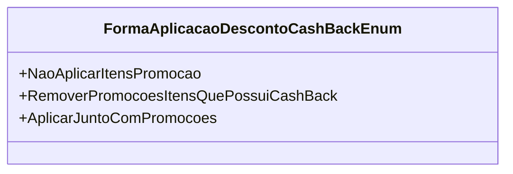

# FormaAplicacaoDescontoCashBackEnum
**Namespace**: IsthmusWinthor.Dominio.Enumeradores  
**Nome do Arquivo**: FormaAplicacaoDescontoCashBackEnum.cs  

Esta classe enumera diferentes formas de aplicação de desconto cashback em um sistema de gestão. Ela fornece uma estrutura clara para determinar como os descontos devem ser aplicados durante as transações de venda, impactando diretamente na experiência do usuário e na lógica de descontos da aplicação. 

## Tipos Auxiliares e Dependências
- Enumeradores: 
  - [FormaAplicacaoDescontoCashBackEnum](FormaAplicacaoDescontoCashBackEnum.md)

## Diagrama de Relacionamentos

---
Gerada em 29/12/2025 20:54:59
