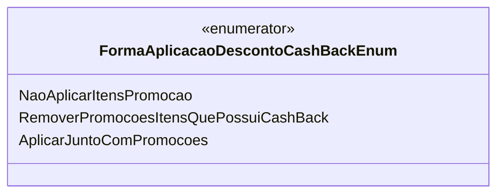

# FormaAplicacaoDescontoCashBackEnum
**Namespace**: IsthmusWinthor.Dominio.Enumeradores  
**Nome do Arquivo**: FormaAplicacaoDescontoCashBackEnum.cs  

Esta classe é um enumerador que define as diferentes formas de aplicação de descontos do tipo Cash Back em um sistema de vendas. Seu propósito é categorizar como os descontos devem ser aplicados aos itens em promoção, ajudando a garantir que as regras de negócio em torno da aplicação de descontos sejam seguidas corretamente.

## Tipos Auxiliares e Dependências
- `FormaAplicacaoDescontoCashBackEnum`: Enumerador que define opções para a aplicação de desconto Cash Back.

## Diagrama de Relacionamentos

Neste diagrama, a classe `FormaAplicacaoDescontoCashBackEnum` é representada como um enumerador com três opções que definem como os descontos Cash Back devem ser tratados no contexto do sistema de vendas.
