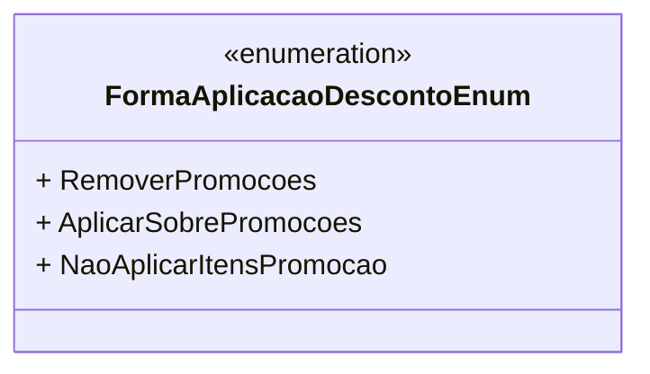

# FormaAplicacaoDescontoEnum
**Namespace**: IsthmusWinthor.Dominio.Enumeradores  
**Nome do Arquivo**: FormaAplicacaoDescontoEnum.cs  

Este é um enumerador que define as diferentes formas de aplicação de descontos em um sistema. Ele tem a função de categorizar como os descontos devem ser aplicados nas transações, influenciando o resultado financeiro e a percepção de promoções pelos usuários.

## Tipos Auxiliares e Dependências
- Nenhum tipo auxiliar ou classe estática adicional é utilizado.

## Diagrama de Relacionamentos

---
Gerada em 29/12/2025 20:55:03
