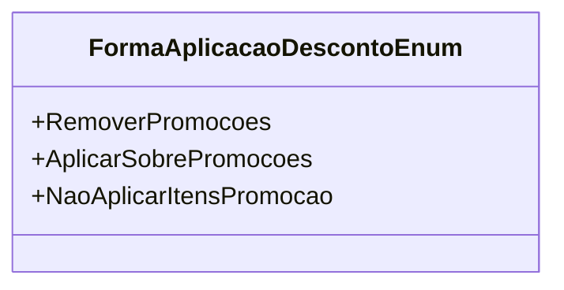

# FormaAplicacaoDescontoEnum
**Namespace**: IsthmusWinthor.Dominio.Enumeradores  
**Nome do Arquivo**: FormaAplicacaoDescontoEnum.cs  

Este enumerador define as diferentes formas de aplicação de descontos em um sistema, resolvendo o problema de como gerir promoções em itens de venda, permitindo diferentes comportamentos em relação aos itens em promoção.

## Tipos Auxiliares e Dependências
- Este enum é uma classe auxiliar que permite configurar a lógica de negócio relacionada à aplicação de descontos.

## Diagrama de Relacionamentos

