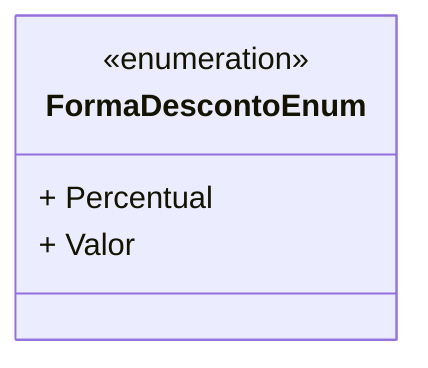

# FormaDescontoEnum
- **Namespace**: IsthmusWinthor.Dominio.Enumeradores
- **Nome do Arquivo**: FormaDescontoEnum.cs

### Citação
`FormaDescontoEnum` é um enumerador que define as diferentes formas de aplicação de descontos, permitindo uma melhor representação dos tipos de desconto em sistemas corporativos.

### Tipos Auxiliares e Dependências
- Nenhuma dependência complexa ou classe estática mencionada além do próprio tipo enum.

### Diagrama de Relacionamentos

---
Gerada em 29/12/2025 20:55:06
