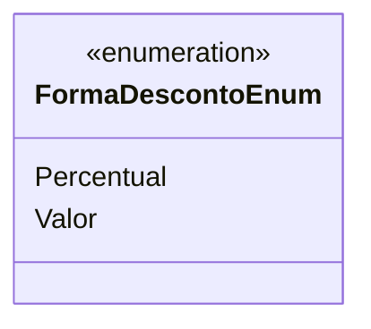

# FormaDescontoEnum
**Namespace**: IsthmusWinthor.Dominio.Enumeradores  
**Nome do Arquivo**: FormaDescontoEnum.cs  

### Visão Geral e Responsabilidade
O `FormaDescontoEnum` é uma enumeração que define as diferentes formas de aplicação de descontos em transações financeiras. A classificação dessas formas permite que o sistema controle e aplique descontos de maneira precisa, garantindo que a lógica de cálculo de preços seja clara e consistente.

### Métodos de Negócio
Nenhum método de negócio aplicável. A enumeração é utilizada apenas para definir constantes que representam formas de desconto.

### Propriedades Calculadas e de Validação
Nenhuma propriedade calculada ou de validação.

### Navigation Property
Nenhuma propriedade de navegação.

### Tipos Auxiliares e Dependências
- Nenhum enumerador ou classe auxiliar.

### Diagrama de Relacionamentos

