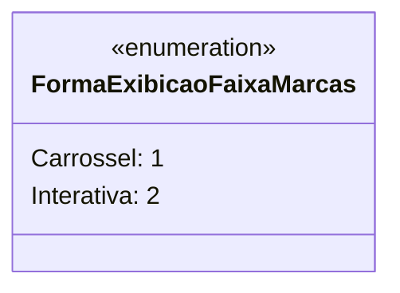

# FormaExibicaoFaixaMarcas
**Namespace**: IsthmusWinthor.Dominio.Enumeradores  
**Nome do Arquivo**: FormaExibicaoFaixaMarcas.cs  

O enumerador `FormaExibicaoFaixaMarcas` define as diferentes formas de exibição disponíveis para faixas de marcas no sistema. Ele facilita a escolha de como as informações são apresentadas ao usuário, permitindo uma melhor experiência na interface.

## Tipos Auxiliares e Dependências
- `FormaExibicaoFaixaMarcas`: Este é um enumerador que define duas opções de exibição.

## Diagrama de Relacionamentos

