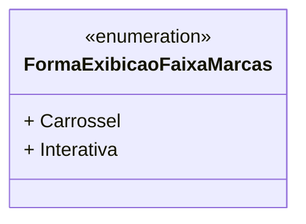

# FormaExibicaoFaixaMarcas

**Namespace**: IsthmusWinthor.Dominio.Enumeradores  
**Nome do Arquivo**: FormaExibicaoFaixaMarcas.cs  

Esta classe define um enumerador que especifica as diferentes formas de exibição para a faixa de marcas dentro do sistema.

## Tipos Auxiliares e Dependências

- Enumeradores:  
  - [FormaExibicaoFaixaMarcas](FormaExibicaoFaixaMarcas.md) 

## Diagrama de Relacionamentos

---
Gerada em 29/12/2025 20:55:10
