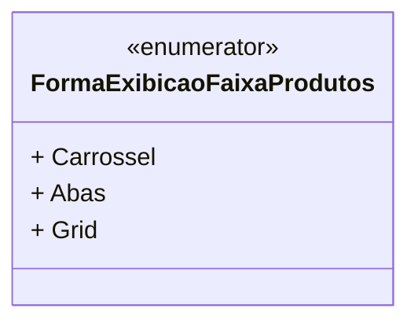

# FormaExibicaoFaixaProdutos
**Namespace**: IsthmusWinthor.Dominio.Enumeradores  
**Nome do Arquivo**: FormaExibicaoFaixaProdutos.cs  

Este enum define as diferentes formas de exibição para faixas de produtos dentro do sistema de domínio. Ele serve como um conjunto de constantes que ajudam a garantir a integridade e a clareza nas opções de exibição disponíveis.

## Tipos Auxiliares e Dependências
- Enumeradores:
  - `[FormaExibicaoFaixaProdutos](FormaExibicaoFaixaProdutos.md)`

## Diagrama de Relacionamentos

