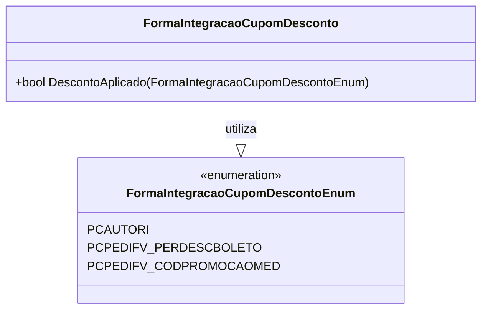

# FormaIntegracaoCupomDescontoEnum

**Namespace**: IsthmusWinthor.Dominio.Enumeradores  
**Nome do Arquivo**: FormaIntegracaoCupomDesconto.cs

### Visão Geral e Responsabilidade
O `FormaIntegracaoCupomDescontoEnum` representa diferentes formas de integração de cupons de desconto no sistema. O principal objetivo desta enumeração é definir os tipos de integrações disponíveis, facilitando a identificação e o tratamento específico de cada forma de desconto no fluxo de aplicação de regras de negócios.

### Tipos Auxiliares e Dependências
- Enumeração: `[FormaIntegracaoCupomDescontoEnum](FormaIntegracaoCupomDescontoEnum.md)`

---

# FormaIntegracaoCupomDesconto

**Namespace**: IsthmusWinthor.Dominio.Enumeradores  
**Nome do Arquivo**: FormaIntegracaoCupomDesconto.cs

### Visão Geral e Responsabilidade
A classe estática `FormaIntegracaoCupomDesconto` fornece métodos auxiliares para trabalhar com a enumeração `FormaIntegracaoCupomDescontoEnum`. O método `DescontoAplicado` é responsável por determinar se um determinado tipo de integração já implicou na aplicação de um desconto sobre o preço, ajudando na validação de regras de negócio ao processar transações com cupons de desconto.

### Métodos de Negócio

#### Título: `DescontoAplicado` - Public
- **Objetivo**: Determina se a forma de integração implica que o preço já foi ajustado com o desconto do cupom.
- **Comportamento**: 
  1. O método recebe um valor do tipo `FormaIntegracaoCupomDescontoEnum`.
  2. Ele verifica se o valor não é igual a `FormaIntegracaoCupomDescontoEnum.PCPEDIFV_PERDESCBOLETO`.
  3. Se o valor não for igual, isso indica que o desconto já foi aplicado; caso contrário, significa que o desconto não foi aplicado.
- **Retorno**: Retorna um booleano (`true` ou `false`) que indica se o desconto já foi aplicado ou não.

### Diagrama de Relacionamentos

Essa documentação técnica reflete a funcionalidade e as regras de negócio relacionadas à classe `FormaIntegracaoCupomDesconto`, evidenciando sua importância na aplicação de cupons de desconto dentro do sistema.
