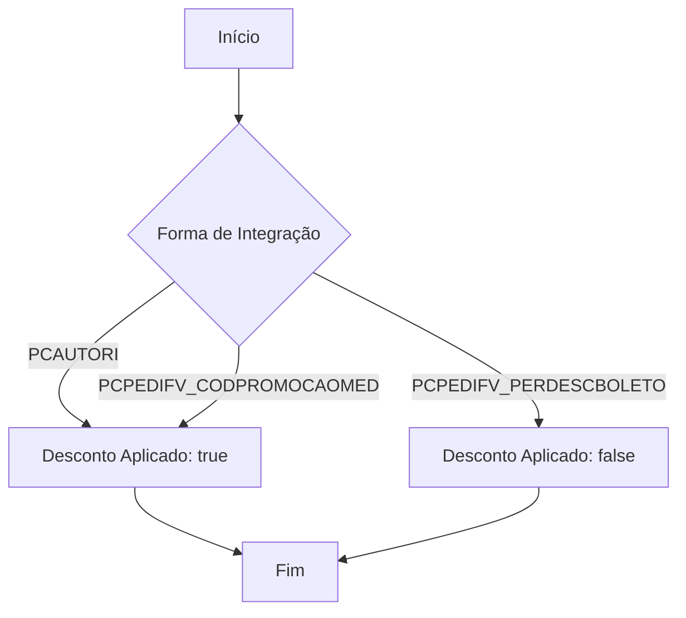
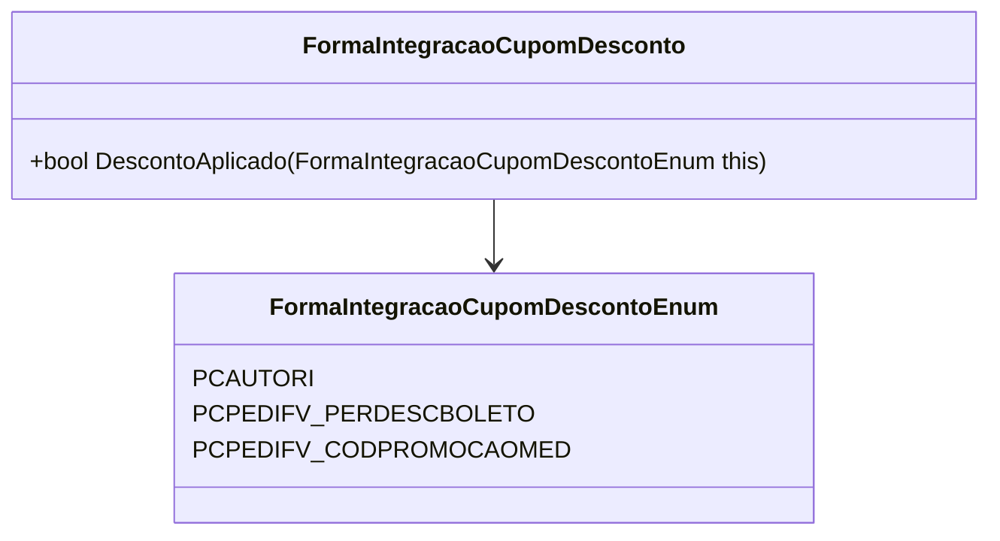

# FormaIntegracaoCupomDesconto

**Namespace**: IsthmusWinthor.Dominio.Enumeradores  
**Nome do Arquivo**: FormaIntegracaoCupomDesconto.cs  

## Visão Geral e Responsabilidade
A classe `FormaIntegracaoCupomDesconto` contém funcionalidades auxiliares que determinam se uma determinada forma de integração de cupom de desconto já aplica o desconto ao preço final do produto. Essa lógica é crucial para evitar a aplicação dupla de descontos e garantir um processo de checkout claro e transparente para o usuário.

## Métodos de Negócio

### Título: DescontoAplicado (public static)

- **Objetivo**: Determinar se a forma de integração escolhida já inclui o desconto do cupom aplicado.
- **Comportamento**: 
  1. O método recebe um valor do enumerador `FormaIntegracaoCupomDescontoEnum`.
  2. Verifica se o valor é diferente de `FormaIntegracaoCupomDescontoEnum.PCPEDIFV_PERDESCBOLETO`.
  3. Retorna `true` se o desconto foi aplicado, caso contrário, retorna `false`.
  
- **Retorno**: 
  - `true`: O desconto já está aplicado na forma de integração.
  - `false`: O desconto não está aplicado.

## Propriedades Calculadas e de Validação
- Não há propriedades que contenham lógica no `get` ou validação no `set` nesta classe.

## Navigations Property
- Não existem propriedades que sejam classes complexas do domínio nesta classe.

## Tipos Auxiliares e Dependências
- Enumerador: 
  - [FormaIntegracaoCupomDescontoEnum](FormaIntegracaoCupomDescontoEnum.md)

## Diagrama de Relacionamentos

---
Gerada em 29/12/2025 20:55:24
