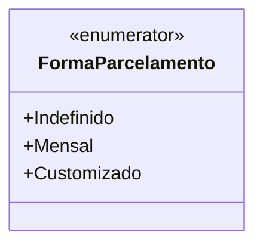

# FormaParcelamento
**Namespace**: IsthmusWinthor.Dominio.Enumeradores  
**Nome do Arquivo**: FormaParcelamento.cs  

Este enumerador define as formas de parcelamento disponíveis no sistema, permitindo ao usuário escolher entre diferentes opções de pagamento ao adquirir um produto ou serviço.

---

### Tipos Auxiliares e Dependências
- **Enums**:
  - [FormaParcelamento](FormaParcelamento.md)

---

### Diagrama de Relacionamentos

---
Gerada em 29/12/2025 20:55:27
